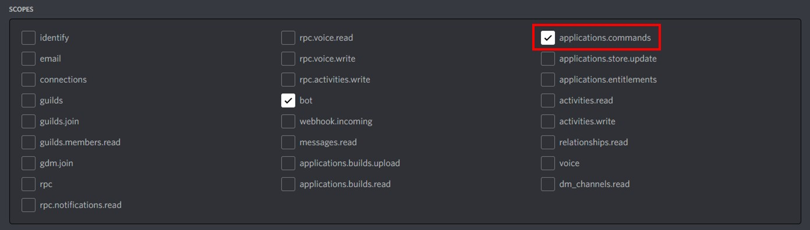
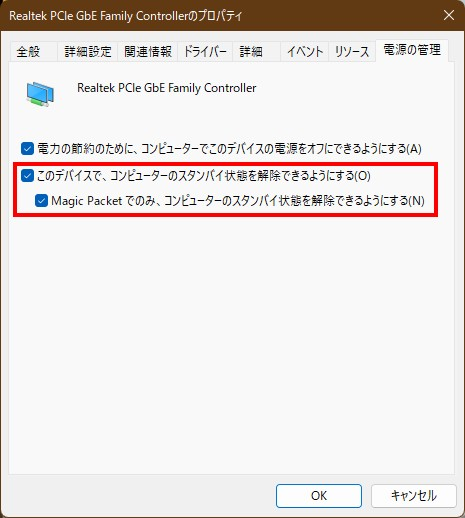
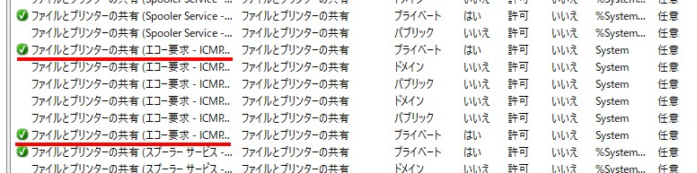

# WakeOnLanBot
リモート上からPCを起動する事を想定した、[Discord](https://discord.com/)のBotです。外出先等から自宅のゲーミングPCを起動して、[Steam Link](https://store.steampowered.com/app/353380/Steam_Link/?l=japanese)等を使用して、お手元のスマートフォン、タブレット、ノートPC等で、外出先からゲームプレイが出来ます。

## 特徴
- スラッシュコマンドを通じて[Discord](https://discord.com/)上からPCを起動、シャットダウン出来ます。
- PCの起動状態をBotのステータスからPCの状態を確認出来ます。

## 準備物
- Botを起動しておくPC
  - Unix系OSにして下さい。
  - Raspberry Piでも構いません。
- LAN
  - リモート上から起動させるPCとBotを起動しておくPCを同じLANに繋いで下さい。
- [Discord](https://discord.com/)アカウント
  - 持っていればそれで大丈夫です。持ってない場合は作成して下さい。

## 使用する条件等
**リモート上から起動させるPC**
- WindowsPC
- Wake On LANに対応している。
- OpenSSHを使用出来るようにセットアップして下さい。
	- 公開鍵認証でログイン出来るようにして下さい。

**Botを起動しておくPC**
- Unix系OS（MacOS、Raspberry Pi OS等）
- [Node.js](https://nodejs.org/) v18.3が実行可能である。
- リモート上から起動させるPCと同じLANに接続されている。

## セットアップ（簡易版）
### Botの作成
1. [Discord](https://discord.com/)のBotを作成します。作成方法は[こちら](https://github.com/Gakuto1112/MinecraftDiscordChatSync#%E3%83%9C%E3%83%83%E3%83%88%E3%82%A2%E3%82%AB%E3%82%A6%E3%83%B3%E3%83%88%E3%81%AE%E4%BD%9C%E6%88%90%E6%96%B9%E6%B3%95)をご覧下さい。なお、**Botの権限で、「applications.commands」の権限を付与して下さい。**

	

2. 作成したBotを任意のサーバーに招待して下さい。

### Wake On LANの準備
1. Windowsボタンを右クリック -> 「デバイスマネージャー」 -> 「ネットワークアダプター」 -> ネットワークアダプター名を右クリック -> 「プロパティ」 -> 「電源の管理」より、「このデバイスで、コンピューターのスタンバイ状態を解除できるようにする」と、任意で「Magic Packetでのみ、コンピューターのスタンバイ状態を解除できるようにする」にチェックを入れます。

	

2. 必要に応じて、電源プランやBIOSのファームウェアの設定を変更して下さい。

### Pingの準備
Windowsではファイアウォールで、デフォルトでPingに応答しない設定になっている可能性があります。
1. 「コントロールパネル」 -> 「Windows Defender ファイアウォール」 -> 「詳細設定」 -> 「受信の規則」に移動します。
2. 規則一覧の中から「ファイルとプリンターの共有（エコー要求 - ICMPv4 受信）」と「ファイルとプリンターの共有（エコー要求 - ICMPv6 受信）」を有効化します。接続されているネットワークの種類（プライベート、パブリック）に合わせて有効化する規則を変えて下さい。
	

### Botを起動しておくPCの準備
1. このレポジトリのファイルをダウンロードして下さい。
2. カレントディレクトリをこのフォルダに移動します。
3. ```npm install```と入力して必要なモジュール群をインストールします。
4. ```sudo apt-get install etherwake```と入力してetherwakeをインストールします。
5. ```ts-node WakeOnLanBot.ts```と入力してBotのプログラムを起動します。
   - ```ts-node```が存在しないと表示された場合は、```node_modules/.bin/ts-node WakeOnLanBot.ts```と入力しても動作します。
6. 設定ファイルが生成されるのでテキストエディタで設定項目を記述します。
   ```json
	{
		"token": "<Botのトークン>",
		"targetIPAddress": "<リモート上から起動させるPCのIPアドレス>",
		"targetMacAddress": "<リモート上から起動させるPCのMACアドレス>",
		"deviceName": "<リモート上から起動させるPCの名前>",
		"userName": "<SSHのユーザー名>",
    	"port": 22,
    	"privateKeyFile": "<SSHの秘密鍵ファイルのパス>"
	}
	```
7. 再び5.を実行してBotを起動します。設定が正常であればBotがオンラインになります。
8. 必要に応じでプログラムの自動実行を設定して下さい。

## 使用方法
- Botがいるサーバーで```/wol```と入力するとBotが反応して対象のPCが起動します。
- ```/shutdown```と入力すると、確認の後、PCをシャットダウンします。
	- シャットダウンボタンは10秒以内に押して下さい。

**コマンドの反映に最大1時間程かかる場合があります。**

## 注意事項
- ちゃっちゃと作成したプログラムです。手厚いサポートは期待しないで下さい。